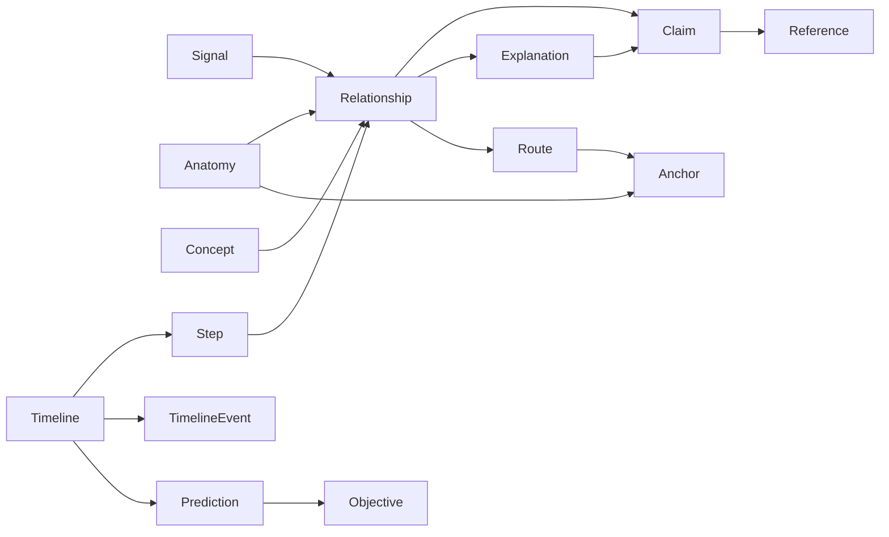

# Domain model and data contracts

## Storage model

**No database, authentication, backend service or cloud persistence is required or permitted in R1.** Source-controlled structured files are the content store. A build-time compiler validates and packages them into one immutable content bundle plus a small search/catalog manifest. A static host serves those artifacts and the application.

Use JSON for canonical authoring records and runtime delivery. Small Markdown files may be used for editorial working notes, but published explanations are plain text with paragraph breaks plus structured concept/reference links. Do not accept raw HTML or executable MDX as content.

[content-contract.ts](contracts/content-contract.ts) is normative for field names. Implement equivalent strict runtime schemas in the application with unknown fields rejected. Generate inferred TypeScript types from those runtime schemas to prevent drift; verify compatibility with the normative contract rather than maintaining independent handwritten runtime types.

## Identity and versions

IDs use lowercase ASCII kebab case and an entity prefix: `sig-`, `anat-`, `concept-`, `rel-`, `claim-`, `ref-`, `ctx-`, `why-`, `obj-`, `j-`, `state-`, `exercise-`, `pred-`, `pair-`, `anchor-`, `route-`, `asset-`, `review-`. IDs are stable across text corrections and independent of translated labels. Track, step, event and timing-band IDs are globally unique by prefixing the timeline ID, e.g. `j-hpa-step-source`.

Renaming an ID creates a retired entry with an optional replacement. Retired IDs are never reassigned to a different concept. A replacement link is offered explicitly; do not silently substitute and resume playback.

`schemaVersion` changes only for incompatible contract changes. `contentVersion` uses semantic versioning: major for removed/reinterpreted IDs or changed assessed meaning, minor for additive lessons or substantive scientific changes, patch for nonsemantic corrections. Any bundle change still invalidates its scientific review hash. Build IDs and filenames identify immutable artifacts independently of semantic version.

## Entity relationships



The physiological graph can contain cycles, including feedback. The Why explanation graph cannot contain a directed cycle. Timeline events are an ordered script over the graph, not a graph traversal that discovers physiology at runtime.

## Normative semantic invariants

| Code | Validation rule |
|---|---|
| VAL-001 | All IDs are unique within the bundle; every typed reference resolves to the expected entity type |
| VAL-002 | All three depths are nonempty on every DepthText field; fields have length limits and contain no HTML |
| VAL-003 | Every published scientific statement has nonempty, applicable claim links; references, roles and context IDs resolve |
| VAL-004 | Causal relationship support includes an approved causal claim other than unresolved; associative/descriptive edges cannot drive causal effect animation |
| VAL-005 | Inhibitory/stimulatory effects require causal kind; associative edges use `associated-with`; descriptive edges use `describes`; feedback edges require causal kind |
| VAL-006 | Every relationship has a Why root; explanation deeper links form a DAG, max three children; linked concepts exist |
| VAL-007 | Timeline duration is an integer 1–600000 ms; all steps/events occur within 0..duration; predictions satisfy 0 ≤ atMs < revealAtMs ≤ duration |
| VAL-008 | Events sort by `(atMs, order)`; `order` is unique in each timeline; IDs and track references resolve; conflicting commands at one timestamp fail |
| VAL-009 | Track count is 1–4, events at most 2000; track order is unique; each track has an initial step at zero and at most one step at each timestamp |
| VAL-010 | Step claims, edge context, timing bands and timeline scenario are applicable to each other, as verified by reviewer plus machine intersection checks |
| VAL-011 | Every anatomy record resolves to an anchor; every route endpoint resolves; required visible anchors exist in each supported renderer |
| VAL-012 | Each question has 2–4 distinct options, exactly one correctOptionId, option-specific feedback and claim links; objective/context/exposure references resolve; familyId is nonempty and groups matched forms |
| VAL-013 | Each checkpoint's reveal steps begin at or after revealAtMs; revealAtMs must precede the next checkpoint; at most one checkpoint at a timestamp |
| VAL-014 | Comparison has exactly one cell for every required dimension; no duplicate pair member; all curated pairs resolve |
| VAL-015 | Production forbids fixtures, draft/withdrawn claims, missing/expired approval, invalid scientific hash, unlicensed assets and mismatched bytes hashes |
| VAL-016 | Every R1 inventory item exists; all journeys/states satisfy content/prediction minimums; navigation reaches every released item |
| VAL-017 | Plain strings max 10000 chars, labels max 120, IDs max 120; total graph max 10000 records and Why traversal max 100 nodes per root for R1 |
| VAL-018 | Asset and content paths stay same-origin and reject `..`, protocol prefixes and leading double slash; external citation URLs permit HTTPS only |
| VAL-019 | Anatomy parent graph is acyclic; its roots and view transitions are defined; left/right duplicates do not share ambiguous pick IDs |
| VAL-020 | Source catalog IDs exactly match the release manifest catalog; retired IDs are disjoint from active IDs; manifest/bundle versions and hashes agree |

An applicability machine check requires an intersection between the active timeline context IDs and the referenced relationship/claim context IDs. A general context can be listed explicitly on both; there is no hidden inheritance. This catches omissions but cannot certify scientific applicability. Reviewer sign-off remains required.

Commands at the same timestamp conflict if they write the same property of the same semantic ID, even with identical values. Authors must merge or retime them. Multiple tracks affecting one signal must be authored into one shared visible trend; the renderer does not sum contradictory qualitative effects.

`transports` is still a causal communication claim and requires suitable support. `modulates` cannot be used to evade an unknown direction: its caption must explain the scoped effect, and it cannot automatically increase/decrease another value.

## Build pipeline contract

Input: `content/**/*.json`, semantic anatomy mappings, approved assets and review ledger. Steps: parse → schema validate → cross-reference validate → timeline/graph validate → calculate scientific hash → check review → compile deterministic bundle → calculate delivered-byte hash → emit manifest/search index → package static build.

The deterministic bundle's records are sorted by ID; timeline arrays are normalized to their specified order. Repeated builds of identical inputs produce identical content bytes and scientific hashes. Build timestamps belong outside the hashed scientific payload.

Development has an explicit fixture mode. The [synthetic fixture](examples/synthetic-feedback.json) is a playback-spec fixture, not a complete `ContentBundle`; its own schema is specified in document 06. Its fictional relations may be adapted into a private development bundle under `fixture: true`. Never add a hidden production “skip review” environment variable.

Validation errors contain a stable error code, source file, record ID, JSON path and plain-language explanation. Stop before deployment; do not prune invalid relations and publish a misleading partial pathway. Independent draft files outside the release manifest may remain in authoring directories, but production's included dependency closure must be entirely approved.

## Runtime loading and compatibility

1. Load the manifest and validate its small schema before displaying the catalog.
2. Load the exact hash-named bundle, check delivered SHA-256 and parse with the matching runtime schema.
3. Resolve route IDs only after manifest validation; display metadata/loading while bundle loads.
4. Cache the parsed bundle in memory for the session. Serve immutable assets with HTTP caching. Do not mix records from multiple versions.
5. If schema, hash or version fails, render “This lesson version could not be loaded” with retry and Home. Keep diagnostics; do not guess a migration.

One bundle is intentionally adequate for R1. Split content into independently versioned lesson packs only after measuring a budget problem, and then preserve atomic manifest consistency. The model/brain assets are separately lazy-loaded regardless of content bundling.

## Local learner record

Use `localStorage` keys `human-signals:preferences:v1` and `human-signals:progress:v1`. No IndexedDB, hosted database or server sessions. Store:

- Preferences: depth, view preference, motion override (`system`, `reduce`, `full`), contrast preference and playback speed.
- Progress: contentVersion, completed timeline IDs, attempts (question ID, family ID, objective ID, selected option ID or skip, correctness, first-attempt/practice status, exposed-before flag, timestamp) and exposure family IDs.

Each attempt also has a stable random `attemptId` for local multi-tab merge. Predictions include explicit exposure timeline/relationship/explanation IDs. Compile a reverse index from those IDs to families so inspecting source material marks relevant answers as exposed. The question's own timeline is not automatically an exposure timeline: its reveal boundaries govern exposure unless explicitly listed. Validate these IDs and require editorial review for the completeness of the exposure map.

Keep at most 500 attempts and 500 exposure family IDs, dropping oldest attempts first. If exposure history would overflow, conservatively mark all older families as previously exposed; never make old questions look new. Do not store body measurements, personal details, full browsing history or physiology entered by a learner. A local timestamp is for ordering only, not trusted scoring authority.

Unknown schema or malformed storage is ignored with a nonblocking reset notice. A known schema migration is explicit, pure and tested. Completion may remain historical across content versions, but changed assessment meaning invalidates current-version results. Preserve previous versions in a bounded historical summary; never claim a migrated mastery result. Storage failure must not prevent a lesson or question from working in memory.

## Manifest and route examples

Canonical links use hash routing for any static host:

```text
/#/explore?signal=sig-cortisol&depth=standard
/#/journey/j-hpa?depth=mechanism&step=j-hpa-step-source
/#/state/state-stress?depth=intro
/#/compare?a=sig-adrenaline&b=sig-cortisol&depth=standard
/#/learn
/#/about
```

URLs contain content IDs and preferences only. Attempts and local progress never enter the URL. `step` references a stable authored step, not an arbitrary millisecond or measured time. Unknown optional parameters are ignored; invalid enum values use documented defaults; unknown IDs show recovery; URL length is bounded at 2048 characters. The URL's explicit depth overrides local preference for that route; selecting a new depth updates both URL and stored preference.
