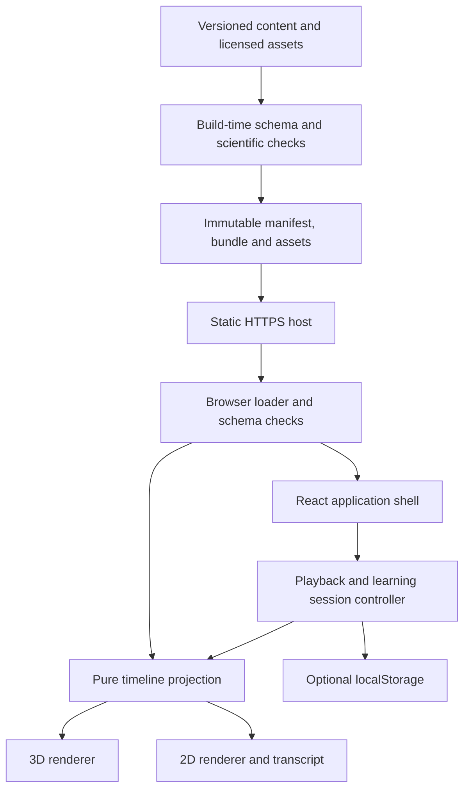

# Technical architecture

## Stack and deployment shape

Build a **static browser web app** using React, TypeScript in strict mode, Vite, React Router hash routing, Three.js with React Three Fiber for 3D, SVG/HTML for 2D, Zod for runtime schemas, Vitest and Testing Library for unit/component tests, and Playwright with axe integration for browser checks. Use CSS modules and design tokens; no component framework is required. Use npm with a committed lockfile and a pinned supported Node LTS version selected and verified during bootstrap.

These are design choices, not a claim that current package versions were researched. At implementation, choose mutually compatible supported releases, record exact versions and licenses, and avoid unpinned `latest` in reproducible commands. Keep dependencies minimal; no physics engine, graph database, simulation framework, state-machine package or external analytics SDK.

**No authentication, account model, database, backend API, server-side rendering requirement, serverless functions or remote progress service.** Browser storage holds optional local preferences/progress. Static JSON is the curriculum. Hosting serves files only. There are no secrets needed in the browser or application deployment.

## System diagram



## Suggested repository layout

```text
documentation/                  # This specification remains authoritative
src/
  app/                          # Bootstrap, hash routes, error boundaries, layouts
  content/                      # Runtime schemas, loader, indexed queries
  engine/                       # Pure projection, clock adapter, session reducer
  features/
    explore/                    # Search, selection, anatomy tree, signal detail
    journey/                    # Steps, captions, transport controls
    states/                     # Shared engine, multi-track presentation
    why/                        # Explanation trail, glossary, evidence
    compare/                    # Aligned signal comparison
    learn/                      # Predictions, feedback, local results
    settings/                   # Depth, motion, view and local-data reset
  renderers/
    anatomy3d/                  # Lazy-loaded Three/R3F adapter
    diagram2d/                  # SVG plus equivalent HTML interaction
  platform/                     # Storage, reduced motion, visibility, diagnostics
  components/                   # Reused accessible UI primitives only
  styles/                       # Tokens, global reset, shared layout rules
content/
  records/                      # Authoring JSON
  reviews/                      # Actual reviewer records
  fixtures/                     # Fictional development data; excluded in production
assets/
  source/                       # Original model sources and provenance
  optimized/                    # Licensed optimized model files
scripts/                        # Content compiler, validation and budget tools
tests/
  unit/
  integration/
  e2e/
  fixtures/
  visual/
public/                         # Static non-generated shell assets
```

This is a boundary guide, not a requirement to create empty directories or one class per noun. Shared code should be extracted only when actual consumers need it. The engine must run in tests without React, DOM or WebGL.

## Module interfaces

```ts
interface ContentRepository {
  load(): Promise<ContentBundle>;
  getTimeline(id: string): Timeline | undefined;
  getSignal(id: string): Signal | undefined;
  getRelationship(id: string): Relationship | undefined;
  search(query: string, limit: number): SearchResult[];
}

interface RendererProps {
  frame: Frame;
  selection: Selection | null;
  depth: Depth;
  reducedMotion: boolean;
  onSelect: (selection: Selection) => void;
  onOpenRelationship: (relationshipId: string) => void;
  onFailure: (errorCode: string) => void;
}

interface ProgressStore {
  read(): ProgressReadResult;
  write(progress: ProgressRecord): { ok: boolean };
  clear(): { ok: boolean };
}
```

Interface names here describe required responsibilities; referenced application types are implemented at bootstrap. Queries are indexed Maps over the validated bundle, not network calls. Do not add an abstract repository hierarchy with unused server adapters.

## State ownership

| State | Owner | Lifetime and URL policy |
|---|---|---|
| Validated bundle and search index | Content loader/context | One immutable version per session |
| Current route, selected page IDs, depth, requested step | Router | Canonical hash URL |
| Cursor, playback status, active question, speed | Session reducer | Memory; speed preference persisted |
| Selection inside scene and focused track | Feature state | Memory unless represented by an explicit route |
| Camera orientation, panel trail, viewport quality | Renderer/UI | Memory; never part of scientific state |
| Preferences, completions, attempts, exposure | Platform storage adapter | Local-only bounded versioned record |

React Context and reducers are sufficient. Do not push 60 Hz cursor updates through the full application tree. Expose a small frame store/subscription or renderer-local update adapter while captions/control labels update only on relevant semantic changes. Establish a single cursor owner; neither R3F nor SVG creates an independent lesson clock.

## Routing

Routes: `/`, `/explore`, `/journey/:id`, `/state/:id`, `/compare`, `/learn`, `/exercise/:id`, `/about`. They appear after the URL hash. Explore query supports exactly one primary selection: `signal`, `anatomy` or `concept`. When more than one is present, select the first in that precedence order and normalize the URL. A scene selection that opens an entity panel updates the corresponding query.

Depth defaults to explicit URL → valid stored preference → Intro. View defaults to stored preference → 3D when available, with 2D immediately usable while 3D loads. Timeline step defaults to overview at cursor zero. Comparing missing `a`/`b` renders the appropriate chooser. IDs must resolve to the route's entity kind.

Step changes use URL replacement so the Back stack is not filled with every playback event. The URL updates on explicit step selection, not every animation tick. Sharing builds a canonical URL from the current active step. Opening a link never autoplays. Normal top-level navigation uses history push.

## Startup and loading

Render the shell first. Fetch and validate manifest, then content. The default accessible 2D summary is usable before 3D code/model download. Start 3D loading when the visible view requests it; brain detail downloads only when opened. Use cancelable fetches on teardown. A stale request cannot replace the active bundle or route.

Loading text appears immediately; a retryable failure appears after a 15-second application timeout. Retry is user-triggered with at most one in-flight attempt. Browser HTTP caching can satisfy subsequent loads. Do not implement a service worker in R1; stale-cache complexity is unnecessary for this stage.

## Error boundaries and diagnostics

Separate shell, content and renderer error boundaries. A 3D failure preserves content and switches to 2D. Invalid scientific content prevents that bundle from rendering. A missing individual source website does not invalidate checked bibliographic metadata or silently remove the reference.

Stable error codes include `CONTENT_NETWORK`, `CONTENT_SCHEMA`, `CONTENT_HASH`, `CONTENT_VERSION`, `ROUTE_UNKNOWN`, `ASSET_LOAD`, `WEBGL_UNAVAILABLE`, `WEBGL_CONTEXT_LOST`, `STORAGE_UNAVAILABLE` and `ENGINE_INVALID_STATE`.

Keep a local in-memory ring buffer of at most 100 diagnostic entries (error code, app build, content version, route kind and time). Do not include URL queries, free text, attempts, answers or browser fingerprint. “Copy diagnostics” produces user-reviewable plain text and uses the clipboard only after a deliberate click. No automatic uploads.

## Build and command contract

The implementation must expose these npm scripts, with names stable enough for an autonomous agent and CI:

| Script | Required behavior |
|---|---|
| `dev` | Local development; fixture content explicitly labeled if enabled |
| `typecheck` | Strict TypeScript including content compiler |
| `lint` | Source lint and prohibited-pattern checks |
| `content:validate` | All included records, graph, timing and inventory checks |
| `content:build` | Deterministically generate manifest and bundle |
| `test` | Unit and integration tests; no external accounts or adjacent repositories |
| `test:e2e` | Browser journeys, reduced motion, unavailable WebGL and route reloads |
| `test:budgets` | Bundle/asset size and reproducible performance checks |
| `build:preview` | Private fixture/draft build with persistent preview banner and noindex |
| `build` | Fail-closed production build with scientific and license gates |
| `preview` | Serve built static files locally for production-shape checks |

CI installs from the lockfile, validates, checks types/lint, runs tests, builds, performs browser and budget checks, and stores artifacts. A preview CI lane can run against synthetic content while public production remains blocked by content readiness. Do not conflate the two statuses.

## Deliberately absent APIs

There are no login, user, session, content CRUD, assessment submission or analytics HTTP endpoints. Source updates are repository changes followed by static builds. If future account sync is requested, it requires a new architecture decision and a privacy model; do not prebuild it now.
